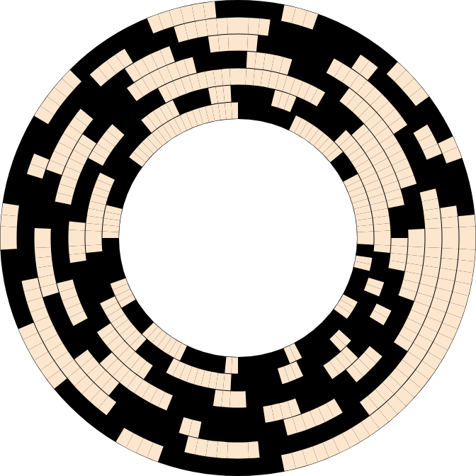

# Beckett-Gray Codes Research

> Recherche d'un code de Beckett-Gray pour n=7 par backtracking exhaustif sur l'hypercube Q_n.

[](https://isocpp.org/)
[](LICENSE)

## Contexte

Travail d'Étude et de Recherche réalisé en Master 1 Algorithmie (Université de Montpellier, 2024) sous l'encadrement de Stéphane Bessy (LIRMM), en binôme avec Mattéo Mennesson.

Un code de Beckett-Gray correspond à un cycle hamiltonien dans l'hypercube Q_n sous contrainte FIFO sur l'ordre d'extinction des bits. Aucune méthode constructive n'est connue : la recherche se fait par énumération exhaustive guidée par heuristiques.

## Résultats principaux

- **Découverte d'un code de Beckett-Gray pour n=7** en 17h sur PC portable monoprocesseur
- À comparer aux **80h sur cluster 25 cœurs** dans la référence Cooke et al. (2016), soit ≈117 fois moins de processor-hours
- Génération exhaustive vérifiée pour n=5 (1920 codes) et partielle pour n=6 (1.86M codes)
- Génération partielle pour n=8 (234 premiers bits sur 256)
- Conjectures originales sur la structure des codes (gaps réguliers dans la matrice de réversion, concentration des classes non-isomorphes en début de génération)

## Approche technique

Backtracking exhaustif en C++ avec optimisations bitwise (`-O3`), guidé par 4 heuristiques implémentées et benchmarkées individuellement :

1. **Sommets pendants** : détection des sommets de degré 1 dans le graphe induit (O(n) par appel récursif)
2. **Propriété eulérienne** : exploitation de la partition des sommets par poids de Hamming (triangle de Pascal)
3. **Équivalence sous réversion** : élimination des branches symétriques
4. **Borne FIFO** : limite maximale d'itérations consécutives à 1 sur un bit

Chaque heuristique a réduit significativement le nombre d'appels récursifs : de 64M à 6.6M appels pour n=5 (×10).

## Structure du projet

.
├── core/
│ ├── cpp/ # Implémentation principale (BeckettGrayFinal.cpp)
│ ├── py/ # Prototype Python initial
│ └── notebooks/ # Analyse statistique des codes générés
├── report/ # Rapport LaTeX complet (40+ pages)
├── beamer/ # Slides de soutenance
├── dist/ # Rapport PDF + slides PDF
└── src/ # Code source de la GitHub Pages

## Compilation et exécution

### Code C++ (recherche de codes)

```bash
cd core/cpp
g++ -O3 -std=c++17 BeckettGrayFinal.cpp -o beckett
./beckett <n>
```

Le code écrit les solutions dans `core/cpp/results/codes_n=<n>.txt`.

### Analyse statistique (Python)

```bash
cd core/notebooks
jupyter notebook BGC_data_analysis.ipynb
```

## Documents

- **Rapport complet** : [Rapport_TER_Lucas_Noirot_Mattéo_Mennesson.pdf](dist/Rapport_TER_Lucas_Noirot_Mattéo_Mennesson.pdf)
- **Slides de soutenance** : [Slides TER Mattéo Mennesson Lucas Noirot.pdf](dist/Slides%20TER%20Mattéo%20Mennesson%20Lucas%20Noirot.pdf)
- **Page web du projet** : [enpeluche.github.io/beckett-gray-research](https://enpeluche.github.io/beckett-gray-research)

## Code de Beckett-Gray pour n=7



_Représentation circulaire des 128 mots binaires de 7 bits formant un code de Beckett-Gray valide. Chaque rayon correspond à un mot, lu de l'intérieur (bit de poids faible) vers l'extérieur (bit de poids fort). Le noir représente les bits à 1._

## Bibliographie

- Cooke et al. (2016). _Beckett-Gray Codes_.
- Sawada & Wong (2007). _A fast algorithm to generate Beckett-Gray codes_. Electronic Notes in Discrete Mathematics 29, 571–577.
- Mütze (2023). _Combinatorial Gray Codes — an Updated Survey_. The Electronic Journal of Combinatorics.

## Auteurs

- **Lucas Noirot** — [enpeluche.github.io](https://enpeluche.github.io) — [github.com/enpeluche](https://github.com/enpeluche)
- **Mattéo Mennesson**

Encadrant : **Stéphane Bessy**, LIRMM (Université de Montpellier)

## Licence

MIT
